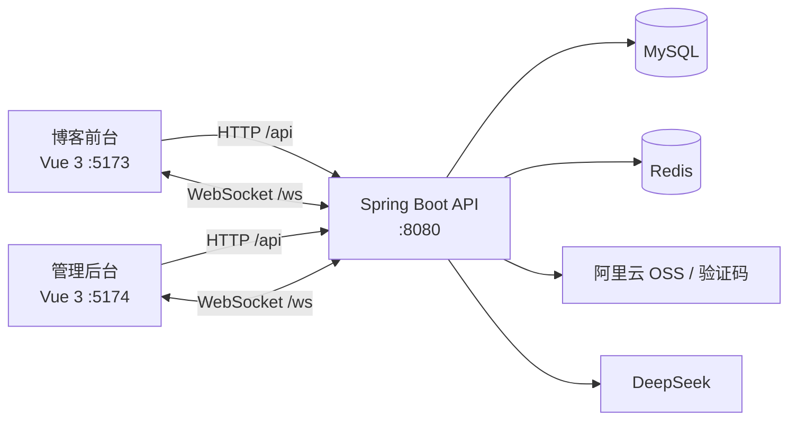

<h1 align="center">Yesir Blog</h1>

<p align="center">基于 Spring Boot 3 与 Vue 3 的前后端分离个人博客系统</p>

<p align="center">
  
  
  
  
  
  
  
</p>

## 项目简介

Yesir Blog 是一套个人博客全栈项目，仓库同时包含面向访客的博客前台、面向运营人员的管理后台，以及为两端提供统一 API 和实时通信能力的 Spring Boot 服务。

- `vue-blog-personal`：博客用户端，负责内容浏览、用户互动和个人中心。
- `vue-blog-management`：博客管理端，负责内容运营、权限管理、数据报表和通知处理。
- `blog-personal-project`：Maven 多模块后端，包含公共模型模块与业务服务模块。

> 当前状态：文章、友链、账号中心及管理后台已接入服务端接口；博客前台的“日常”和“留言”页面仍以组件内模拟数据展示，用户端日常列表/详情和留言持久化链路待补齐。侧栏文章搜索、RSS 入口、账号安全页和登录验证码链路也仍处于占位或未启用状态。

## 核心功能

### 博客前台

- **首页展示**：网站公告、热门文章、内容快捷入口、博主资料、分类、标签云、日历和站点统计。
- **文章阅读**：分页浏览文章，支持列表、双列和三列布局；详情页提供上一篇/下一篇、浏览量、点赞、评论和回复。
- **用户体系**：注册、登录、退出、Access Token 静默续签，以及个人资料、头像和密码修改；公开内容允许游客访问，点赞、评论、回复和个人设置要求登录。
- **友链功能**：展示已通过友链，支持提交申请、查看申请状态和催促审核。
- **个性化体验**：深色/浅色主题、自定义背景、音乐播放器、欢迎横幅、回到顶部和响应式导航。
- **实时数据**：通过 WebSocket 更新在线访客、今日/累计访问量、文章数和站点运行时长。

### 管理后台

- **数据看板**：汇总访问、作品、评论、用户和友链指标，展示多时间范围趋势，并支持导出 Excel 报表。
- **内容管理**：管理文章与日常，支持富文本编辑、文件上传、分类标签、状态切换、置顶、定时发布、预览和批量操作。
- **互动管理**：分别管理文章、日常和留言评论，支持筛选、回复、置顶、隐藏和删除；支持友链申请审核。
- **用户与权限**：用户、角色、菜单和角色授权管理，支持后端动态路由、接口权限与按钮级权限控制。
- **回收站**：覆盖文章、日常、分类/标签、评论、用户、角色和菜单，支持恢复与彻底删除。
- **运营报表**：提供作品、评论、用户和友链的指标、趋势、分布和排行榜，并可生成 AI 运营周报。
- **通知中心**：评论、点赞和友链事件通过 WebSocket 实时推送，支持未读统计、已读处理和管理端在线人数统计。
- **AI 助手**：管理端界面已接入流式对话和快捷提示词；后端另提供文章生成与润色、标题生成、SEO 建议、日志分析和评论回复建议接口。

### 后端服务

- Spring Security + JWT 无状态认证，Access Token 配合 HttpOnly Refresh Token 自动续期。
- 基于用户、角色、菜单和权限标识的 RBAC 权限模型。
- MyBatis + MySQL 数据持久化，PageHelper 分页，Redis 缓存。
- 阿里云 OSS 文件上传，以及阿里云验证码相关配置与客户端封装。
- WebSocket 实时通知与在线统计。
- 定时任务每分钟扫描并发布到期文章和日常。
- Spring AI 对接 DeepSeek，提供内容创作和运营辅助能力。
- 统一响应、全局异常处理和参数校验；仓库包含尚未注册启用的 XSS 请求过滤实现。

## 系统架构



## 技术栈

| 分层 | 主要技术 |
| --- | --- |
| 博客前台 | Vue 3、Vite 3、Vue Router、Pinia、Element Plus、Axios |
| 管理后台 | Vue 3、Vite 3、Vue Router、Pinia、Element Plus、WangEditor、ECharts |
| 后端服务 | Java 17、Spring Boot 3.3.8、Spring Security、JWT、WebSocket、Spring Scheduling |
| 数据访问 | MySQL 8、MyBatis 3、PageHelper、Redis |
| 外部能力 | Spring AI、DeepSeek、阿里云 OSS、阿里云验证码、Apache POI |
| 其他 | Font Awesome、Lucide、xss |

## 目录结构

```text
blog-personal/
|-- vue-blog-personal/                 # 博客用户端
|   |-- src/api/                       # 用户端接口封装
|   |-- src/components/                # 公共组件
|   |-- src/router/                    # 路由与登录态恢复
|   `-- src/views/                     # 页面视图
|-- vue-blog-management/               # 管理后台
|   |-- src/api/                       # 管理端接口封装
|   |-- src/components/                # 公共组件
|   |-- src/stores/                    # Pinia 状态与动态权限
|   `-- src/views/                     # 业务页面
|-- blog-personal-project/             # Spring Boot 后端
|   |-- blog-common/                   # 实体、DTO/VO、结果封装、工具类
|   `-- blog-server/                   # Controller、Service、Mapper 与配置
|       `-- src/main/resources/static/ # 数据库初始化脚本
|-- LICENSE                            # 项目许可证
`-- login-template-LICENSE             # 登录模板第三方许可证
```

## 环境要求

| 环境 | 版本/说明 |
| --- | --- |
| JDK | 17 |
| Maven | 3.8 或更高版本，仓库未提供 Maven Wrapper |
| Node.js | 18 或更高版本 |
| npm | 9 或更高版本 |
| MySQL | 8.0，初始化脚本使用 MySQL 8 排序规则 |
| Redis | 推荐 7.x |

阿里云 OSS、阿里云验证码和 DeepSeek 属于外部服务。当前后端配置会在启动时读取相关环境变量，因此启动前需要提供对应配置。

## 快速开始

### 1. 获取项目

```bash
git clone https://github.com/tiggeryjl/blog-personal.git
cd blog-personal
```

### 2. 初始化数据库

数据库脚本位于 [`blog-personal-project/blog-server/src/main/resources/static`](./blog-personal-project/blog-server/src/main/resources/static)。使用 MySQL 客户端或图形化工具按以下顺序执行：

```text
blogSysUser.sql
blogArticle.sql
blogDaily.sql
blogComment.sql
blogLink.sql
blogDevice.sql
```

每个脚本都会创建并使用 `blog` 数据库。脚本包含 `DROP TABLE IF EXISTS` 和演示数据，请仅对空库或可丢弃的开发库执行，已有数据请先备份。`blogUser.sql` 是已淘汰的数据表脚本，不需要导入。

### 3. 配置后端

开发环境默认读取 [`application-dev.yml`](./blog-personal-project/blog-server/src/main/resources/application-dev.yml)，请根据本机环境修改 MySQL 和 Redis 的地址、账号与密码。公共配置位于 [`application.yml`](./blog-personal-project/blog-server/src/main/resources/application.yml)。

至少需要设置以下环境变量：

| 变量 | 是否必需 | 用途 |
| --- | --- | --- |
| `OSS_ACCESS_KEY_ID` | 是 | 阿里云 OSS 与验证码 AccessKey ID |
| `OSS_ACCESS_KEY_SECRET` | 是 | 阿里云 OSS 与验证码 AccessKey Secret |
| `DEEPSEEK_API_KEY` | 是 | DeepSeek API 密钥 |
| `SPRING_PROFILES_ACTIVE` | 否 | Spring Profile，默认值为 `dev` |

PowerShell 示例：

```powershell
$env:OSS_ACCESS_KEY_ID = "your-access-key-id"
$env:OSS_ACCESS_KEY_SECRET = "your-access-key-secret"
$env:DEEPSEEK_API_KEY = "your-deepseek-api-key"
```

Bash 示例：

```bash
export OSS_ACCESS_KEY_ID="your-access-key-id"
export OSS_ACCESS_KEY_SECRET="your-access-key-secret"
export DEEPSEEK_API_KEY="your-deepseek-api-key"
```

使用自己的阿里云资源时，还需要替换 `application.yml` 中的 `bucket-name`、`endpoint`、`region` 和 `scene-id`。生产环境请通过安全的配置中心或环境变量覆盖数据库、Redis 和 JWT 密钥，不要将真实密钥提交到仓库。

### 4. 构建并启动后端

```bash
cd blog-personal-project
mvn clean package -Dmaven.test.skip=true
java -jar blog-server/target/blog-server-0.0.1-SNAPSHOT.jar
```

开发环境默认监听 `http://localhost:8080`。

### 5. 启动博客前台

打开新的终端，在仓库根目录执行：

```bash
cd vue-blog-personal
npm ci
npm run dev
```

### 6. 启动管理后台

再打开一个终端，在仓库根目录执行：

```bash
cd vue-blog-management
npm ci
npm run dev
```

### 7. 访问地址

| 服务 | 地址 |
| --- | --- |
| 博客前台 | <http://localhost:5173> |
| 管理后台 | <http://localhost:5174> |
| 后端服务 | <http://localhost:8080> |

初始化脚本提供以下后台测试账号：

| 账号 | 密码 | 角色 |
| --- | --- | --- |
| `yesir` | `123456` | 超级管理员 |
| `lisi` | `123456` | 业务管理员 |

首次登录后请立即修改默认密码。

## 配置说明

### 后端配置

| 文件 | 说明 |
| --- | --- |
| `application.yml` | 公共配置、Profile、文件上传、JWT、OSS 与 AI 配置 |
| `application-dev.yml` | 开发环境端口、MySQL、Redis 和日志级别 |
| `application-prod.yml` | 生产环境端口、MySQL、Redis 和日志级别 |

Spring Boot 配置均可通过环境变量覆盖，例如 `SPRING_DATASOURCE_URL`、`SPRING_DATASOURCE_USERNAME`、`SPRING_DATASOURCE_PASSWORD`、`SPRING_DATA_REDIS_HOST`、`SPRING_DATA_REDIS_PORT`、`SPRING_DATA_REDIS_PASSWORD`、`SPRING_DATA_REDIS_DATABASE`、`SERVER_PORT` 和 `BLOG_JWT_USERSECRETKEY`。

### 前端代理

两个 Vite 开发服务器都会：

- 将 `/api` 请求代理到 `http://localhost:8080`，并移除 `/api` 前缀。
- 将 `/ws` 请求代理到 `http://localhost:8080`，并启用 WebSocket 转发。

管理端通知地址可通过 `VITE_WS_URL` 覆盖，默认值为 `/ws/admin/notice`；用户端通知地址可通过 `VITE_USER_NOTICE_WS_URL` 覆盖，默认值为 `/ws/user/notice`。

## 构建与部署

构建博客前台：

```bash
cd vue-blog-personal
npm ci
npm run build
```

构建管理后台：

```bash
cd vue-blog-management
npm ci
npm run build
```

两个前端的构建产物均输出到各自的 `dist/` 目录。后端执行 `mvn clean package -Dmaven.test.skip=true` 后，JAR 位于 `blog-personal-project/blog-server/target/`。

生产部署时还需要注意：

- 两端请求基址均为同源 `/api`，部署每个前端的域名或端口都需要同时提供 `/api` 与 `/ws` 反向代理。
- `/api/*` 应反向代理到后端并移除 `/api` 前缀。
- `/ws/*` 应反向代理到后端、保留 `/ws` 路径，并配置 WebSocket Upgrade 请求头。
- 两个前端均使用 History 路由，静态服务器需要将未知页面路径回退到对应应用的 `index.html`。
- 管理端 Vite `base` 默认为 `/`；部署到 `/admin/` 等子路径时，需要同步修改 Vite `base` 和路由回退规则。
- `prod` Profile 默认使用 `80` 端口；非特权用户可通过 `SERVER_PORT` 改为其他端口，再由 Nginx 等网关转发。
- 上线前必须修改 JWT 密钥、默认账号密码及所有示例数据库/Redis 凭据。

仓库当前未包含 Dockerfile、Docker Compose、Nginx 或 CI/CD 配置，需要按实际部署环境补充。

## 第三方开源说明

博客前台登录页面基于以下开源项目修改：

| 项目 | 说明 |
| --- | --- |
| 原仓库 | <https://gitee.com/niumg9527/login-animation> |
| 作者 | niumg9527 |
| 协议 | MIT License |
| 使用文件 | `LoginPage.vue`、`AnimatedCharacters.vue` 及其子组件 |
| 修改内容 | 新增注册能力，并适配本项目的认证与提交逻辑 |
| 原始协议 | [login-template-LICENSE](./login-template-LICENSE) |

## License

本项目基于 [MIT License](./LICENSE) 开源。第三方组件仍遵循其各自的许可证。
